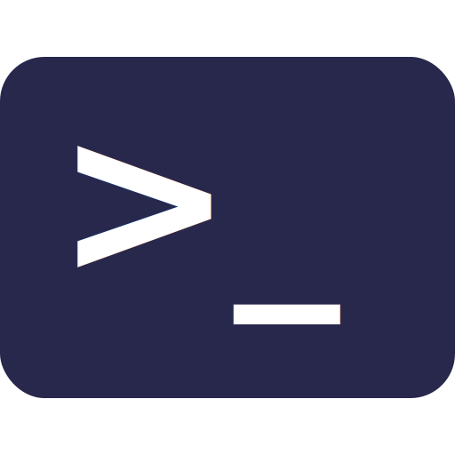

[](https://pypi.python.org/pypi/jishaku)
[](https://github.com/Gorialis/jishaku/blob/master/LICENSE)
[](https://pypi.python.org/pypi/jishaku)
[](https://circleci.com/gh/Gorialis/jishaku)
[](https://ci.appveyor.com/project/Gorialis/jishaku)
[](https://github.com/Gorialis/jishaku/issues)
[](https://github.com/Gorialis/jishaku/commits)

***

<h1 align="center">
<sub>
    
</sub>
&nbsp;
jishaku
</h1>
<p align="center">
<sup>
a debugging and utility extension for discord.py bots
</sup>
<br>
<sup>
    <a href="https://jishaku.readthedocs.io/">Read the documentation online.</a>
</sup>
</p>

***

jishaku is an extension for bot developers that enables rapid prototyping, experimentation, and debugging of features for bots.

One of jishaku's core philosophies is to be dynamic and easy-to-use. Here's the two step install:

> 1. Download jishaku on the command line using pip:
> ```bash
> pip install -U jishaku
> ```
> 2. Load the extension in your bot code before it runs:
> ```python
> bot.load_extension('jishaku')
> ```
> That's it!

You can also import the module to use the command development utilities.

## Index

* [Command reference](#command-reference)
* [Installing development versions](#installing-development-versions)
* [Acknowledgements](#acknowledgements)

## Command reference

<table>
    <tr>
        <td width="60px">
            
        </td>
        <td>
            <h4>&gt; <code>jishaku [py|python] &lt;argument&gt;</code></h4>
            <h4>&gt; <code>jishaku [pyi|python_inspect] &lt;argument&gt;</code></h4>
            The Python commands execute or evaluate Python code passed into them.
            It supports simple expressions:
            <br><br> <!-- Horrifying that I have to do this -->
            <blockquote>
                <p>&gt;  <i>jsk py 3+4</i></p>
                
                    <p><b>Beep Bot</b></p>
                    7
            </blockquote>
            <br>
            It also supports async expressions:
            <br><br>
            <blockquote>
                <p>&gt;  <i>jsk py await _ctx.pins()</i></p>
                
                    <p><b>Beep Bot</b></p>
                    [&lt;Message id=123456789012345678 ...&gt;, ...]
            </blockquote>
            <br>
            You can pass in codeblocks for longer blocks of code to execute, and you can use <code>yield</code> to return intermediate results within your processing.
            <br><br>
            The <i>inspect</i> variant of the command will return a codeblock with detailed inspection information on all objects returned.
            <br><br>
            The variables available by default in all execution contexts are:
            <br><br>
            <table>
                <tr>
                    <td><code>_ctx</code></td>
                    <td>
                        The <a href="https://discordpy.readthedocs.io/en/latest/ext/commands/api.html#discord.ext.commands.Context">Context</a> that invoked the command.
                    </td>
                </tr>
                <tr>
                    <td><code>_bot</code></td>
                    <td>
                        The running <a href="https://discordpy.readthedocs.io/en/latest/ext/commands/api.html#discord.ext.commands.Bot">Bot</a> instance.
                    </td>
                </tr>
                <tr>
                    <td><code>_author</code><br><code>_channel</code><br><code>_guild</code><br><code>_message</code><br><code>_msg</code></td>
                    <td>
                        Shortcuts for attributes on <a href="https://discordpy.readthedocs.io/en/latest/ext/commands/api.html#discord.ext.commands.Context"><code>_ctx</code></a>.
                    </td>
                </tr>
                <tr>
                    <td><code>_find</code><br><code>_get</code></td>
                    <td>
                        Shortcuts for <a href="https://discordpy.readthedocs.io/en/latest/api.html#utility-functions"><code>discord.utils</code></a> functions.
                    </td>
                </tr>
            </table>
            <br>
            The underscore prefix on the provided variables is intended to help prevent shadowing when writing large blocks of code within the command.
            <br>
            If you decide that you don't want the prefix, you can disable it by setting the <code>JISHAKU_NO_UNDERSCORE</code> environment variable to <code>true</code>.
            <br><br>
            Each Python command is individually scoped. That means variables you create won't be retained in later invocations.
            <br>
            You can use <code>jishaku retain on</code> to change this behavior and retain variables, and <code>jishaku retain off</code> if you change your mind later.
            <br><br>
            <h4>&gt; <code>jishaku [dis|disassemble] &lt;argument&gt;</code></h4>
            This command compiles Python code in an asynchronous context, and then disassembles the resulting function into Python bytecode in the style of <code>dis.dis</code>.
            <br><br>
            This allows you to quickly and easily determine the bytecode that results from a given expression or piece of code. The code itself is not actually executed.
            <br><br>
        </td>
    </tr>
</table>

<table>
    <tr>
        <td width="60px">
            
        </td>
        <td>
            <h4>&gt; <code>jishaku [sh|shell] &lt;argument&gt;</code></h4>
            The shell command executes commands within your system shell.
            <br><br>
            If you're on Linux and are using a custom shell, jishaku will obey the <code>SHELL</code> environment variable, otherwise, it will use <code>/bin/bash</code>.
            <br>
            On Windows, jishaku will use PowerShell if it's detected, otherwise, it will use Command Prompt.
            <br><br>
            The results from the commands you pass in are returned through a paginator interface live as the command runs. If you need to stop a command, you can press the stop button reaction, or use <code>jsk cancel</code>.
            <br><br>
            The execution will terminate automatically if no output is produced for 120 seconds.
            <br><br>
            <h4>&gt; <code>jishaku git &lt;argument&gt;</code></h4>
            <h4>&gt; <code>jishaku pip &lt;argument&gt;</code></h4>
            These commands act as shortcuts to the shell command, so you can save typing a word if you use these frequently.
            <br><br>
        </td>
    </tr>
</table>

<table>
    <tr>
        <td width="60px">
            
        </td>
        <td>
            <h4>&gt; <code>jishaku [load|reload] [extensions...]</code></h4>
            <h4>&gt; <code>jishaku unload [extensions...]</code></h4>
            These commands load, reload, or unload extensions on your bot.
            <br><br>
            You can reload jishaku itself with <code>jsk reload jishaku</code>.
            <br>
            <code>jsk reload ~</code> will reload all extensions on your bot.
            <br><br>
            You can load, reload, or unload multiple extensions at once: <code>jsk reload cogs.one cogs.two</code>
            <br><br>
            <h4>&gt; <code>jishaku shutdown</code></h4>
            This command gracefully shuts down your bot.
            <br><br>
            <h4>&gt; <code>jishaku rtt</code></h4>
            This command calculates <a href="https://en.wikipedia.org/wiki/Round-trip_delay">Round-Trip Time</a> for your bot to the API. It does this by calculating response time samples, so you can tell if your bot is being slow or not.
            <br><br>
        </td>
    </tr>
</table>

<table>
    <tr>
        <td width="60px">
            
        </td>
        <td>
            <h4>&gt; <code>jishaku cat &lt;file&gt;</code></h4>
            This command reads a file from your file system, automatically detecting encoding and (if applicable) highlighting.
            <br><br>
            You can use this to read things like bot logs or source files in your project.
            <h4>&gt; <code>jishaku curl &lt;url&gt;</code></h4>
            This command reads text from a URL and attempts to detect encoding and language, similar to <code>jsk cat</code>.
            <br><br>
            You can use this to display contents of files online, for instance, the <code>message.txt</code> files created when a message is too long, or raw files from paste sites.
            <br><br>
        </td>
    </tr>
</table>

<table>
    <tr>
        <td width="60px">
            
        </td>
        <td>
            <h4>&gt; <code>jishaku sudo &lt;command string&gt;</code></h4>
            <h4>&gt; <code>jishaku su &lt;member&gt; &lt;command string&gt;</code></h4>
            <h4>&gt; <code>jishaku in &lt;channel&gt; &lt;command string&gt;</code></h4>
            <h4>&gt; <code>jishaku debug &lt;command string&gt;</code></h4>
            <h4>&gt; <code>jishaku repeat &lt;times&gt; &lt;command string&gt;</code></h4>
            These commands serve as command control for other commands.
            <br><br>
            <code>jishaku sudo</code> bypasses all checks and cooldowns on a given command.
            <br><br>
            <code>jishaku su</code> allows you to execute a command as another user.
            <br><br>
            <code>jishaku in</code> allows you to execute a command in another channel.
            <br><br>
            <code>jishaku debug</code> executes a command with an exception wrapper and a timer. This allows you to quickly get feedback on reproducable command errors and slowdowns.
            <br><br>
            <code>jishaku repeat</code> repeats a command a number of times.
            <br><br>
            <h4>&gt; <code>jishaku permtrace &lt;channel&gt; [targets...]</code></h4>
            This command allows you to investigate the source of expressed permissions in a given channel. Targets can be either a member, or a list of roles (to simulate a member with those roles). 
            <br><br>
            It will read all of the guild permissions and channel overwrites for the given member or roles in the channel, and provide a breakdown containing whether the permission is granted, and the most fundamental reason why.
            <br><br>
        </td>
    </tr>
</table>

## Installing development versions

If you'd like to test the latest versions of jishaku, you can do so by downloading from the git hosts instead of from PyPI.

> From GitHub:
> ```bash
> pip install -U "jishaku @ git+https://github.com/Gorialis/jishaku@master"
> ```
> From GitLab:
> ```bash
> pip install -U "jishaku @ git+https://gitlab.com/Gorialis/jishaku@master"
> ```

Please note that the new 2020 dependency resolver now no longer discounts git package sources from reinstall prevention,
which means that if you are installing the jishaku development version multiple times within the same version target you may run into pip just discarding the update.

If you run into such a problem, you can force jishaku to be reinstalled like this:

> From GitHub:
> ```bash
> pip install -U --force-reinstall "jishaku @ git+https://github.com/Gorialis/jishaku@master"
> ```
> From GitLab:
> ```bash
> pip install -U --force-reinstall "jishaku @ git+https://gitlab.com/Gorialis/jishaku@master"
> ```

You **must** have installed jishaku with one of the commands above before doing this else you will probably end up with a broken installation.

## Acknowledgements

The documentation and this README uses icons from the <a href="https://github.com/google/material-design-icons">Material Design Icon</a> library, which is licensed under the <a href="https://www.apache.org/licenses/LICENSE-2.0.html">Apache License Version 2.0</a>.
